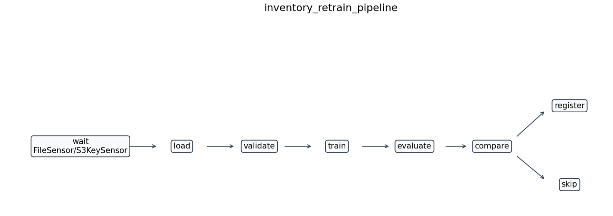
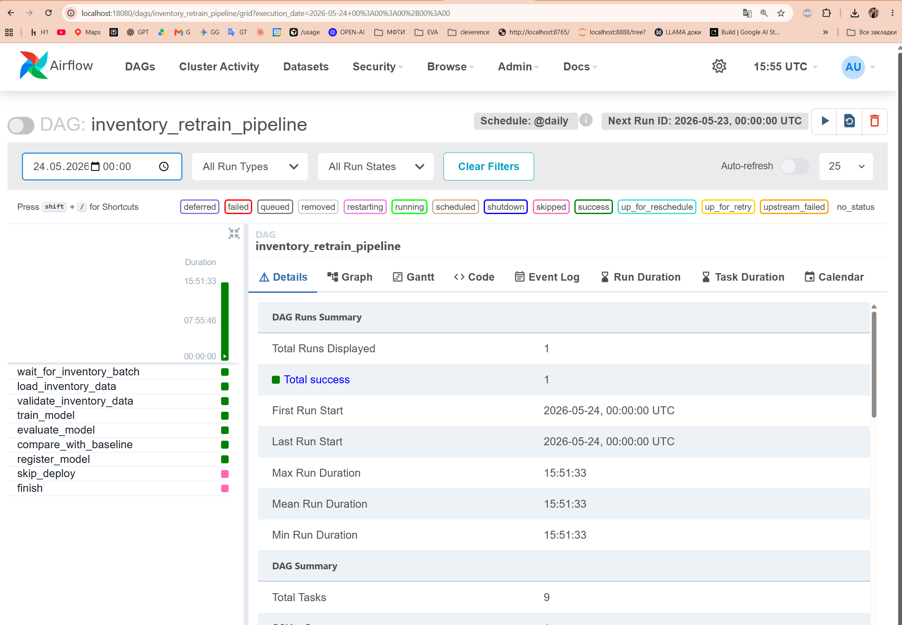
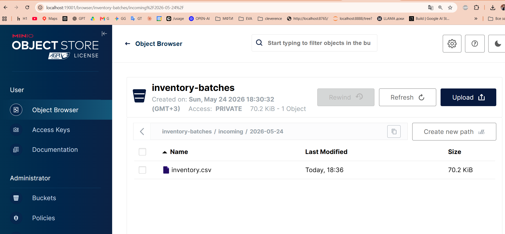
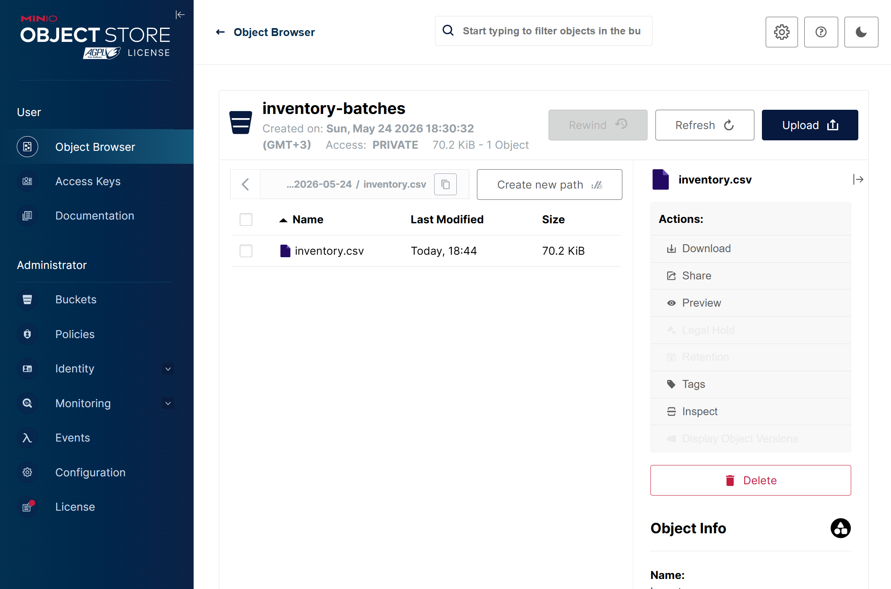
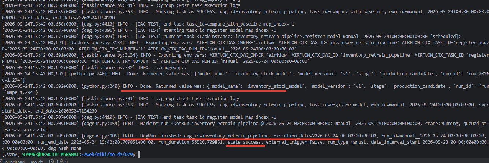
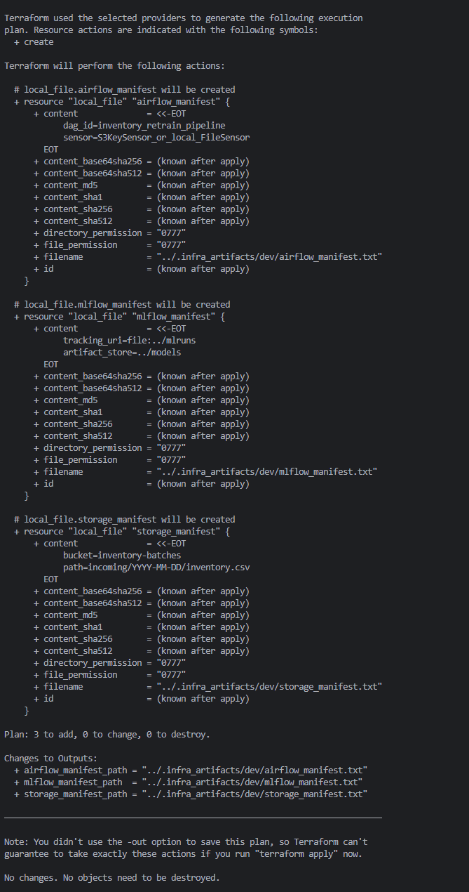
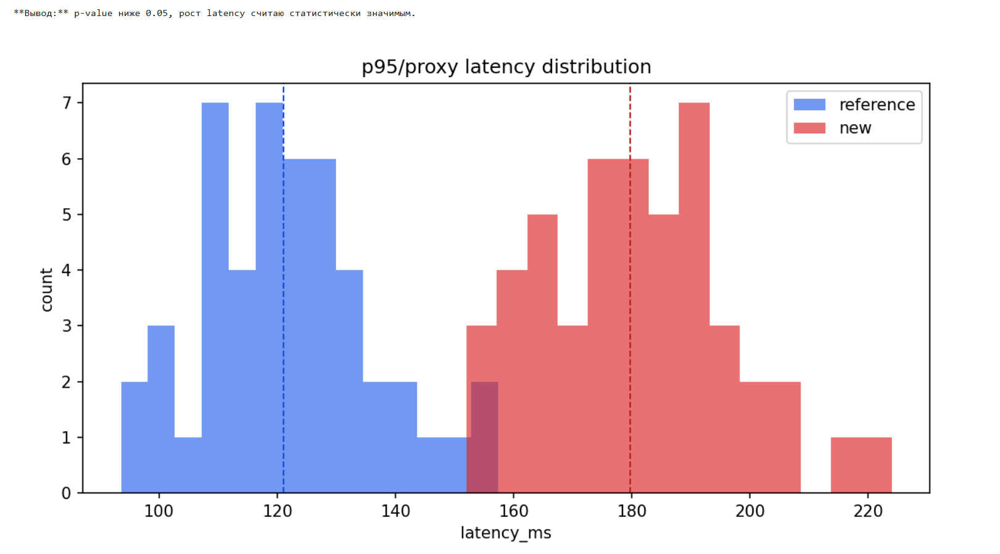

Generated at: 2026-05-24 17:22:41 MSK
Updated at: 2026-05-24 19:29:35 MSK

# ДЗ-9. Проектирование ML-системы для расчета складских запасов

Это финальный стенд для ДЗ-9 по развертыванию ML моделей.

Идея простая:

```text
Airflow управляет ML-процессом
CI/CD проверяет код / DAG / Terraform
Terraform описывает infra
registry хранит факт обучения
SLI/SLO говорят когда вмешиваться
MDD фиксирует решение через статистику
```

## 1. Что сделано

- финальный ноутбук: [HW9_Design_НовиковИван.ipynb](HW9_Design_НовиковИван.ipynb)
- Airflow DAG: [dags/inventory_retrain_dag.py](dags/inventory_retrain_dag.py)
- код модели: [src/](src/)
- synthetic data: [data/](data/)
- Terraform: [infra/](infra/)
- логи / отчеты: [reports/](reports/)
- скриншоты: [screenshots/](screenshots/) + карта [screenshots/README.md](screenshots/README.md)
- MDD decision: [adr/0001-latency-mdd-decision.md](adr/0001-latency-mdd-decision.md)
- CI/CD checks: [.github/workflows/dz9-checks.yml](.github/workflows/dz9-checks.yml)
- compose-стенд Airflow + MinIO: [docker-compose.yml](docker-compose.yml)

## 2. Карта критериев

| критерий | где смотреть | скрины / файлы |
|---|---|---|
| архитектура ML-конвейера | notebook section 1 / этот README | batch + reactive retraining через sensor |
| Airflow DAG | [dags/inventory_retrain_dag.py](dags/inventory_retrain_dag.py) | [screenshots/19.png](screenshots/19.png), [reports/airflow_task_logs.md](reports/airflow_task_logs.md) |
| S3 tracking | MinIO + `S3KeySensor` mode | [screenshots/11.png](screenshots/11.png), [screenshots/18.png](screenshots/18.png), [reports/airflow_sensor_log.md](reports/airflow_sensor_log.md) |
| IaC | [infra/](infra/) | [reports/terraform_plan.txt](reports/terraform_plan.txt), [reports/terraform_destroy_plan.txt](reports/terraform_destroy_plan.txt), [screenshots/21.png](screenshots/21.png) |
| SLI/SLO и риски | notebook section 5 | таблица ниже + notebook |
| MDD | notebook section 6 / ADR | [reports/mdd_test_result.md](reports/mdd_test_result.md), [reports/mdd_latency_distribution.png](reports/mdd_latency_distribution.png), [screenshots/23.png](screenshots/23.png) |

## 3. Структура

```text
DZ9/
|-- README.md
|-- HW9_Design_НовиковИван.ipynb
|-- requirements.txt
|-- docker-compose.yml
|-- dags/
|   `-- inventory_retrain_dag.py
|-- src/
|   |-- inventory_data.py
|   |-- inventory_train.py
|   |-- inventory_evaluate.py
|   `-- inventory_registry.py
|-- infra/
|   |-- providers.tf
|   |-- main.tf
|   |-- variables.tf
|   |-- outputs.tf
|   `-- README.md
|-- reports/
|   |-- airflow_sensor_log.md
|   |-- airflow_task_logs.md
|   |-- model_metrics.md
|   |-- terraform_plan.txt
|   |-- terraform_destroy_plan.txt
|   |-- mdd_test_result.md
|   `-- mdd_latency_distribution.png
|-- screenshots/
|   |-- README.md
|   |-- 1.png
|   |-- ...
|   `-- 23.png
|-- adr/
|   `-- 0001-latency-mdd-decision.md
`-- data/
    |-- demo_inventory_batch.csv
    |-- reference_latency.csv
    `-- new_latency.csv
```

## 4. Архитектура

Выбран вариант:

```text
batch retraining + reactive trigger через S3/File sensor + metric gate + registry
```

Почему так:

- складские остатки / продажи / поставки обычно приходят batch-ами
- задержка в минуты/часы норм для задачи пополнения склада
- Airflow удобен для CT loop: sensor -> validation -> train -> evaluate -> compare
- CI/CD не должен обучать модель каждый день, он проверяет код и конфиги
- новая модель попадает в registry только после сравнения с baseline



`22.png` - схема процесса: дождались batch-файл -> проверили данные -> обучили модель -> сравнили с baseline -> либо `register_model`, либо `skip_deploy`.

## 5. Airflow pipeline

DAG: [dags/inventory_retrain_dag.py](dags/inventory_retrain_dag.py)

Главная цепочка:

```text
wait_for_inventory_batch
  -> load_inventory_data
  -> validate_inventory_data
  -> train_model
  -> evaluate_model
  -> compare_with_baseline
  -> register_model / skip_deploy
  -> finish
```

Что важно:

- `wait_for_inventory_batch` ждет новый batch
- `validate_inventory_data` проверяет контракт колонок и простые правила
- `train_model` обучает простую regression model
- `evaluate_model` считает `MAPE` и `RMSE`
- `compare_with_baseline` решает ветку через `BranchPythonOperator`
- `register_model` пишет факт обучения в локальный registry
- `skip_deploy` оставляет старую модель, если новая хуже



`19.png` - Airflow UI: DAG run завершился успешно, ветка `register_model` прошла, `skip_deploy` пропущен как альтернативная ветка.

Еще по Airflow:

- структура DAG в CLI: [screenshots/16.png](screenshots/16.png)
- DAG появился в Airflow UI: [screenshots/8.png](screenshots/8.png)
- успешный run list: [screenshots/12.png](screenshots/12.png)
- task log с `register_model`: [screenshots/15.png](screenshots/15.png)
- сохраненный лог: [reports/airflow_task_logs.md](reports/airflow_task_logs.md)

## 6. S3 / MinIO режим

В учебном стенде есть два режима sensor-а:

- локальный режим - `FileSensor`, чтобы DAG можно было прогнать без S3
- S3 режим - `DZ9_USE_S3_SENSOR=1`, тогда используется `S3KeySensor`

MinIO тут играет роль локального S3:

```text
bucket: inventory-batches
key: incoming/2026-05-24/inventory.csv
```



`11.png` - в MinIO есть bucket `inventory-batches` и файл `inventory.csv` для запуска retraining.



`18.png` - тот же batch виден в Object Browser. Это входной файл, который ждет Airflow sensor.

Лог S3 sensor-а сохранен в [reports/airflow_sensor_log.md](reports/airflow_sensor_log.md):

```text
S3KeySensor(bucket=inventory-batches, key=incoming/{{ ds }}/inventory.csv)
```

**Вывод:**

- в локальном запуске можно быстро проверить DAG через файл
- в S3-режиме тот же шаг проверяет object storage key
- для production меняется endpoint/credentials, логика DAG остается той же

## 7. Модель / метрики / registry

Модель тут не главная часть ДЗ, поэтому сделана просто:

- признаки: `store_id`, `sku_id`, `stock_qty`, `sales_qty`, `delivery_qty`, `day_of_week`
- target: прогноз остатка на следующий день
- модель: простая regression pipeline
- baseline: naive-подход для сравнения

Метрики из [reports/model_metrics.md](reports/model_metrics.md):

| metric | new model | baseline |
|---|---:|---:|
| MAPE | `1.294` | `5.409` |
| RMSE | `1.595` | `5.786` |

Решение compare task:

```text
policy: new_mape <= 15.0 and new_mape <= baseline_mape
branch: register_model
```



`15.png` - в task log видно: baseline check прошел, модель зарегистрирована как `production_candidate`.

Файлы:

- data validation: [reports/data_validation.md](reports/data_validation.md)
- model metrics: [reports/model_metrics.md](reports/model_metrics.md)
- compare log: [reports/airflow_compare_log.md](reports/airflow_compare_log.md)
- registry log: [reports/airflow_registry_log.md](reports/airflow_registry_log.md)
- registry json: [reports/local_registry.json](reports/local_registry.json)

## 8. Terraform / IaC

Terraform лежит в [infra/](infra/).

Что описано:

- storage manifest для batch-файлов
- artifact/registry path для моделей и метрик
- Airflow manifest с `dag_id`
- destroy path, т.е. infra можно удалить



`21.png` - `terraform plan`: создаются 3 local resources для storage / MLflow-like registry / Airflow manifest.

Файлы и скрины:

- [reports/terraform_plan.txt](reports/terraform_plan.txt)
- [reports/terraform_destroy_plan.txt](reports/terraform_destroy_plan.txt)
- [screenshots/20.png](screenshots/20.png) - `terraform init` / `validate`
- [screenshots/21.png](screenshots/21.png) - planned resources

**Вывод:**

- public cloud тут не поднимаю
- Terraform нужен для декларативного описания ресурсов
- `plan -destroy` показывает путь удаления
- `tfstate`, `.terraform/`, секреты и token-ы в сдачу не идут

## 9. SLI/SLO и риски

Полная таблица есть в notebook section 5:

[HW9_Design_НовиковИван.ipynb](HW9_Design_НовиковИван.ipynb)

Короткая версия:

| уровень | SLI | SLO / normal | critical | действие |
|---|---|---|---|---|
| business | доля SKU с прогнозом на завтра | `>= 95%` ежедневно | `< 90%` | перезапуск DAG / ручной расчет top-SKU |
| business | доля дефицитных SKU, найденных системой | `>= 80%` за неделю | `< 65%` | проверить продажи / пересмотреть модель |
| model/data | MAPE прогноза остатков | `<= 15%` | `> 25%` | не регистрировать модель |
| model/data | data validation pass rate | `100%` critical checks | любой critical fail | остановить train |
| code/API | p95 latency прогноза | `< 300 ms` за день | `> 1000 ms` | bottleneck / rollback |
| infrastructure | successful DAG run rate | `>= 99%` daily runs | 2 падения подряд | разбор Airflow/storage/registry |
| infrastructure | storage availability | `>= 99.5%` за месяц | нет доступа к batch | incident по storage |

Риски:

- batch не пришел -> sensor timeout -> skip training + alert
- batch плохой по схеме -> validation fail -> train не запускаем
- новая модель хуже baseline -> `skip_deploy`
- latency выросла -> MDD test -> архитектурное решение через ADR
- Terraform удаляет лишнее -> смотрим `plan` до apply/destroy

## 10. MDD / ADR

Метрика для MDD:

```text
p95/proxy latency прогноза складских запасов
```

Файлы:

- reference: [data/reference_latency.csv](data/reference_latency.csv)
- new: [data/new_latency.csv](data/new_latency.csv)
- plot: [reports/mdd_latency_distribution.png](reports/mdd_latency_distribution.png)
- test result: [reports/mdd_test_result.md](reports/mdd_test_result.md)
- ADR: [adr/0001-latency-mdd-decision.md](adr/0001-latency-mdd-decision.md)

Результат теста:

```text
test: Mann-Whitney U
alpha: 0.05
p_value: 0.00000000
decision: add cache before stock history read
```



`23.png` - latency у новой версии заметно выше reference. p-value ниже 0.05, значит фиксирую это в ADR.

**Итого по MDD:**

- H0: latency не выросла значимо
- H1: latency выросла значимо
- p-value ниже 0.05
- решение в ADR: добавить cache перед чтением истории остатков
- тяжелые lag features лучше переносить в batch preprocessing

## 11. CI/CD

Workflow: [.github/workflows/dz9-checks.yml](.github/workflows/dz9-checks.yml)

CI/CD тут не обучает модель каждый день.

Он проверяет:

- Python dependencies
- `python -m compileall -q src dags scripts`
- генерацию demo reports
- `terraform fmt`
- `terraform init`
- `terraform validate`
- `terraform plan`

**Вывод:**

- Airflow - runtime orchestration
- GitHub Actions - проверка кода и конфигов
- эти роли не смешиваю

## 12. Скриншоты

Полная карта: [screenshots/README.md](screenshots/README.md)

Скрины, которые стоит открыть:

| скрин | что на нем |
|---|---|
| [screenshots/11.png](screenshots/11.png) | MinIO bucket + batch file |
| [screenshots/15.png](screenshots/15.png) | metric gate + register_model |
| [screenshots/16.png](screenshots/16.png) | структура DAG |
| [screenshots/19.png](screenshots/19.png) | успешный Airflow run |
| [screenshots/21.png](screenshots/21.png) | Terraform plan |
| [screenshots/22.png](screenshots/22.png) | схема ML pipeline |
| [screenshots/23.png](screenshots/23.png) | MDD plot + p-value вывод |

## 13. Проверка

```bash
python3 -m venv .venv
.venv/bin/pip install -r requirements.txt
PYTHONPATH=. .venv/bin/python scripts/generate_demo_artifacts.py
python3 -m compileall -q src dags scripts
```

Airflow + MinIO:

```bash
DZ9_USE_S3_SENSOR=1 docker compose up -d --force-recreate
docker exec dz9_airflow bash -lc 'airflow dags list | grep inventory'
docker exec dz9_airflow bash -lc 'airflow tasks list inventory_retrain_pipeline --tree'
docker exec dz9_airflow bash -lc 'airflow dags test inventory_retrain_pipeline 2026-05-24'
```

UI:

| сервис | URL | login |
|---|---|---|
| Airflow | `http://localhost:18080` | `admin` / `admin` |
| MinIO | `http://localhost:19001` | `minioadmin` / `minioadmin` |

Terraform:

```bash
cd infra
terraform fmt -check
terraform init
terraform validate
terraform plan -out=tfplan
terraform show -no-color tfplan > ../reports/terraform_plan.txt
terraform plan -destroy -out=tfdestroy
terraform show -no-color tfdestroy > ../reports/terraform_destroy_plan.txt
```

## 14. Итог

- [x] архитектуры ML pipeline сравнены в notebook
- [x] выбран batch + reactive retraining
- [x] Airflow DAG есть и запускается
- [x] S3-like tracking показан через MinIO + `S3KeySensor`
- [x] есть validation / train / evaluate / compare / register / skip
- [x] Terraform plan и destroy plan сохранены
- [x] SLI/SLO на business / model-code / infra уровнях есть
- [x] MDD сделан через два latency distribution + p-value
- [x] ADR фиксирует архитектурное решение
- [x] CI/CD проверяет код / DAG / Terraform
