# Скриншоты

Это карта скриншотов для ДЗ-9.

Что тут лежит:

- Airflow DAG и его запуск
- MinIO как S3-like storage
- metric gate и registry decision
- Terraform plan
- MDD: latency plot + p-value

Сначала смотреть эти:

| скрин | зачем |
|---|---|
| [11.png](11.png) | MinIO bucket + входной batch |
| [15.png](15.png) | compare task + `register_model` |
| [16.png](16.png) | структура DAG в CLI |
| [19.png](19.png) | успешный DAG run в Airflow UI |
| [21.png](21.png) | Terraform plan |
| [22.png](22.png) | схема Airflow pipeline |
| [23.png](23.png) | MDD latency distribution |

## 1. Подготовка окружения

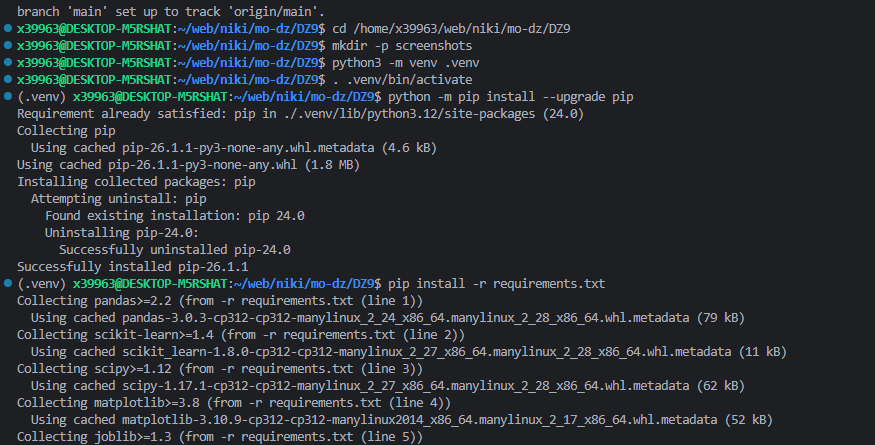

`1.png` - установка Python-зависимостей в `.venv`.

Обычный старт: создал окружение и поставил пакеты.

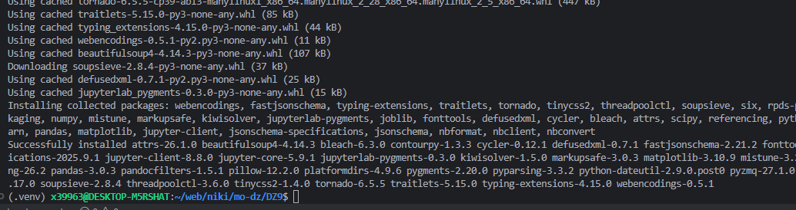

`2.png` - зависимости установлены, проект готов к запуску локальных проверок.

`1.png` и `2.png` частично дублируются. В корневом README оставил скрины ближе к Airflow / MinIO / Terraform.

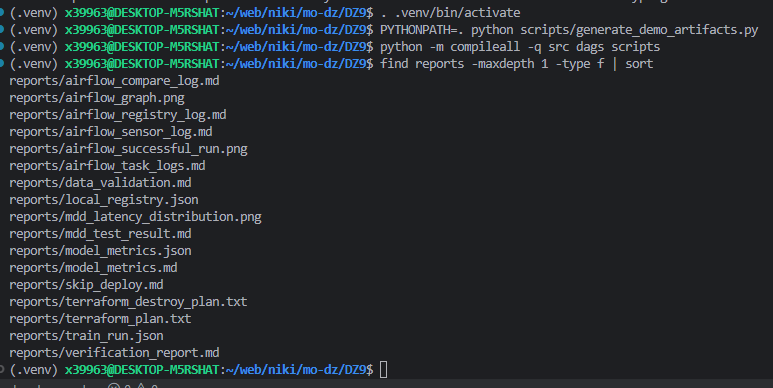

`3.png` - запуск генерации demo artifacts и список файлов в `reports/`.

Тут видно, что на диске появились Airflow logs / model metrics / MDD result / Terraform plan.

## 2. Docker Compose / MinIO / Airflow

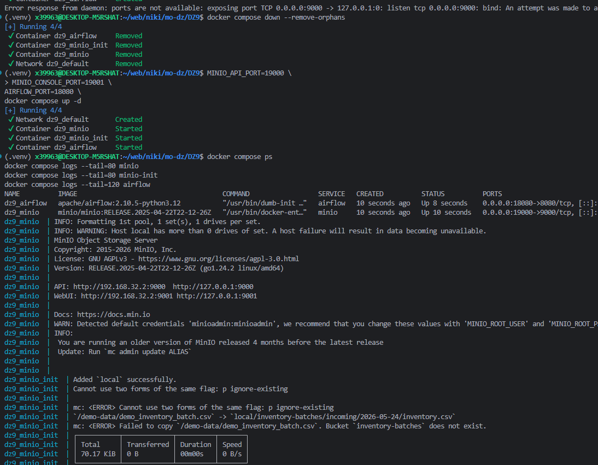

`4.png` - первый запуск compose и перенос портов на `18080`, `19000`, `19001`.

На этом шаге еще была промежуточная ошибка по bucket. Потом перезапустил нормально, это уже видно на `9.png`, `11.png`, `18.png`.

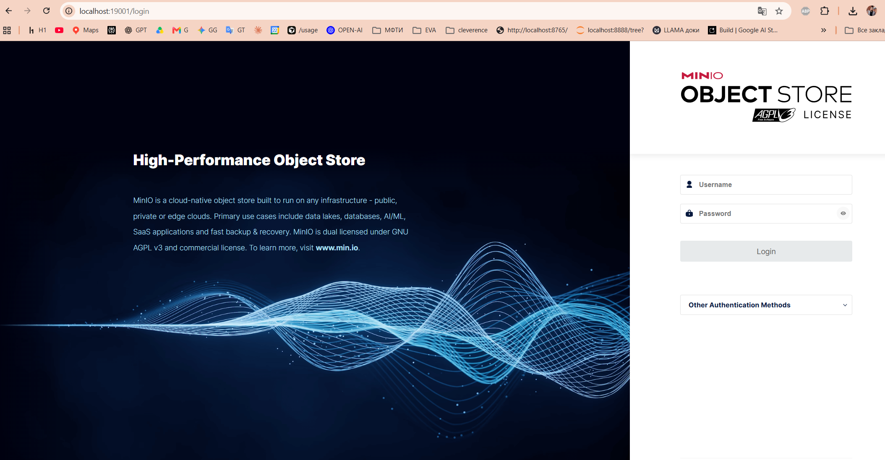

`5.png` - MinIO Console открывается на `http://localhost:19001`.

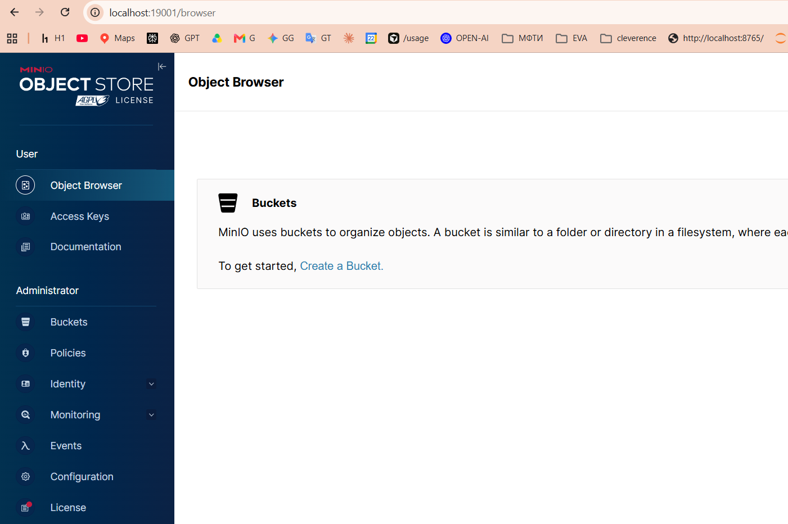

`6.png` - промежуточный вход в Object Browser до успешной загрузки batch-файла.

Тут bucket еще пустой. Дальше файл уже загрузился, это видно на `11.png` и `18.png`.

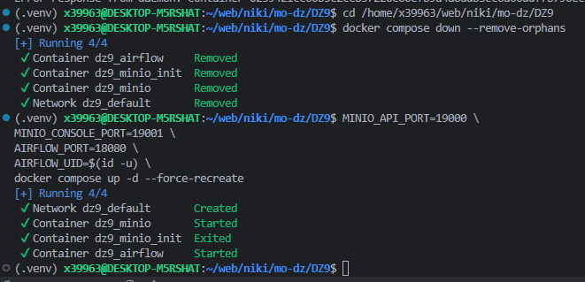

`7.png` - Airflow + MinIO подняты через Docker Compose.

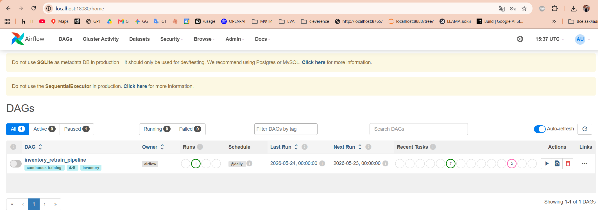

`8.png` - в Airflow UI появился DAG `inventory_retrain_pipeline`.

Тут видно, что DAG зарегистрирован и доступен в интерфейсе.

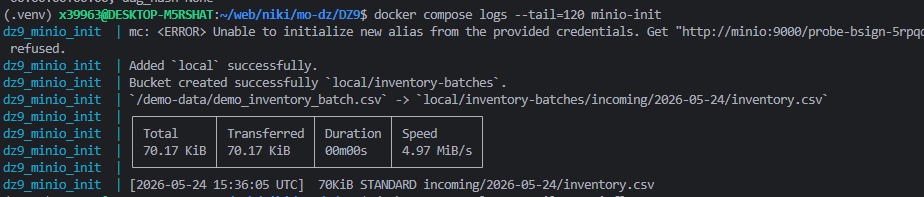

`9.png` - init-контейнер создал bucket `inventory-batches` и загрузил `demo_inventory_batch.csv` в ключ `incoming/2026-05-24/inventory.csv`.

Тут видно, что batch ушел в нужный bucket/key.

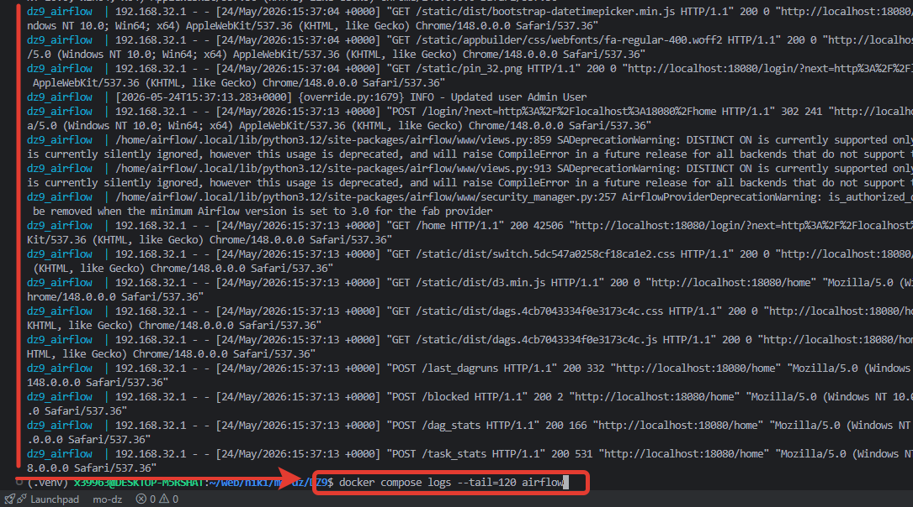

`10.png` - diagnostic screen с логами Airflow webserver.

Это просто лог webserver-а. Сам запуск DAG ниже, там полезнее.


`11.png` - MinIO Object Browser: bucket `inventory-batches`, путь `incoming/2026-05-24`, файл `inventory.csv`.

Тут уже лежит входной batch для Airflow sensor.

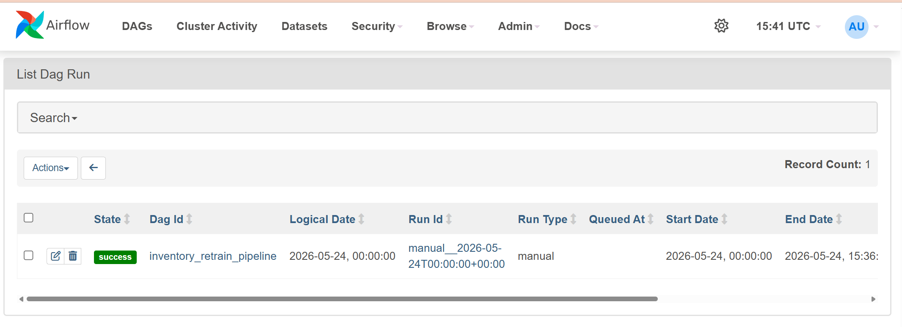

`12.png` - Airflow List Dag Run: DAG `inventory_retrain_pipeline` завершился со state `success`.

## 3. Airflow DAG / metric gate

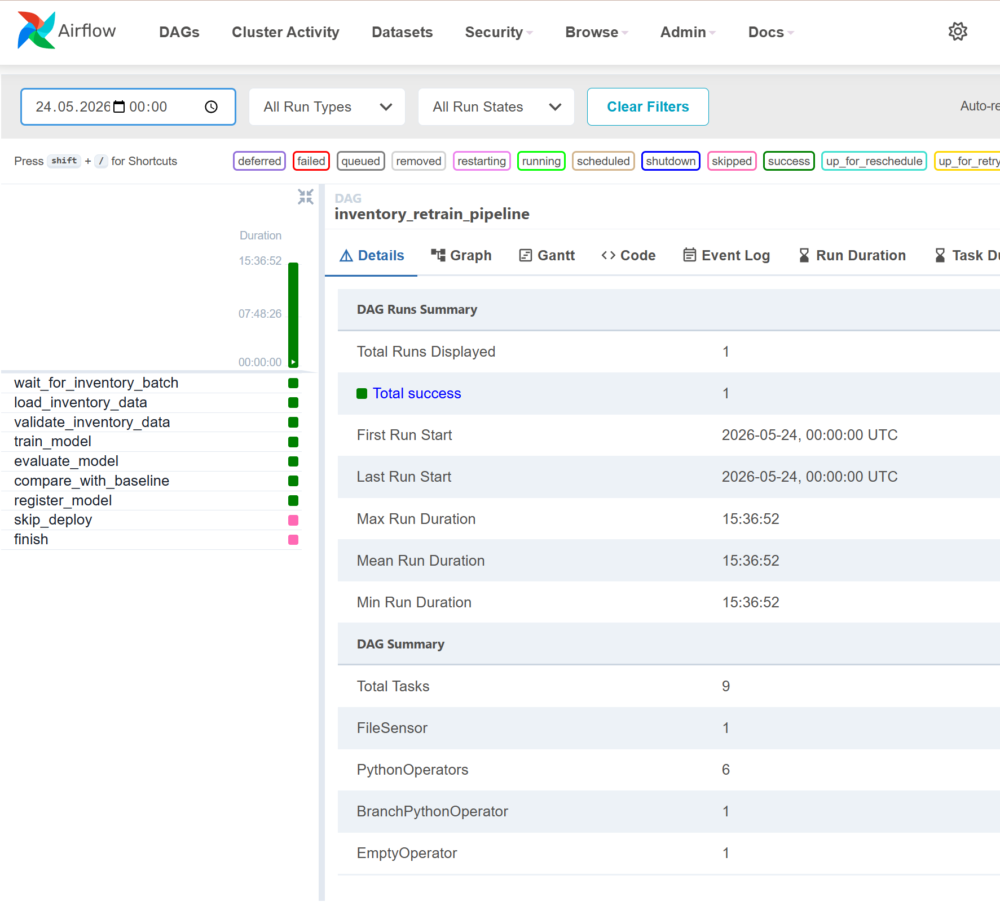

`13.png` - Airflow Details: один успешный DAG run, `register_model` зеленый, `skip_deploy` пропущен.

Airflow пошел в ветку регистрации модели.

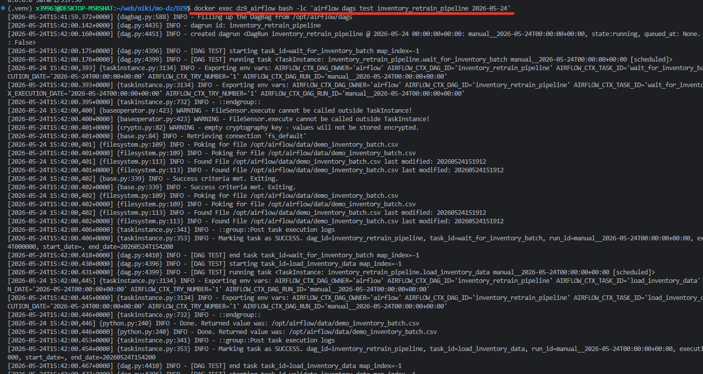

`14.png` - `airflow dags test`: sensor дождался batch-файл, дальше пошла загрузка данных.

На этом скрине режим локальный (`FileSensor`), поэтому для S3-части нужны `11.png` / `18.png` + sensor log.


`15.png` - продолжение `airflow dags test`: compare прошел, `register_model` вернул `inventory_stock_model`, `v1`, `production_candidate`.

Тут видно compare с baseline и запись модели в registry.

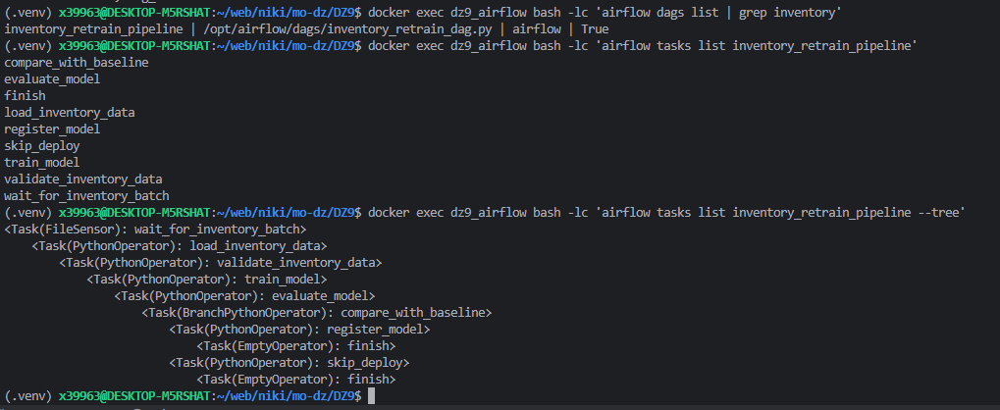

`16.png` - CLI показывает структуру DAG:

```text
wait -> load -> validate -> train -> evaluate -> compare -> register/skip -> finish
```

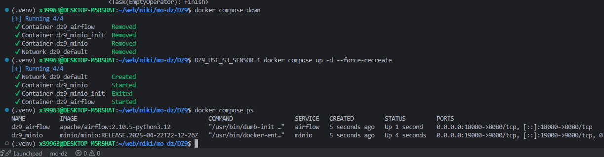

`17.png` - запуск с `DZ9_USE_S3_SENSOR=1`, т.е. S3 mode через MinIO.

Airflow и MinIO подняты на портах `18080`, `19000`, `19001`.


`18.png` - объект `inventory.csv` лежит в bucket `inventory-batches`.

Еще один экран MinIO с тем же входным batch-файлом.


`19.png` - Airflow UI: весь pipeline прошел успешно.

Видно tasks: `wait_for_inventory_batch`, `load_inventory_data`, `validate_inventory_data`, `train_model`, `evaluate_model`, `compare_with_baseline`, `register_model`.

## 4. Terraform / IaC

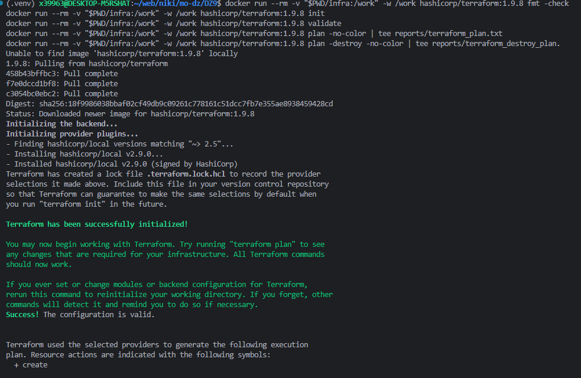

`20.png` - Terraform запускается через Docker, проходит `init` и `validate`.


`21.png` - `terraform plan`: создаются local manifests для Airflow / MLflow-like registry / storage.

Тут видно:

- `dag_id=inventory_retrain_pipeline`
- `sensor=S3KeySensor_or_local_FileSensor`
- `bucket=inventory-batches`
- `path=incoming/YYYY-MM-DD/inventory.csv`

## 5. Архитектура DAG


`22.png` - схема Airflow pipeline.

Логика:

```text
sensor -> load -> validate -> train -> evaluate -> compare -> register/skip
```

Эту схему добавил, чтобы сразу было понятно, как идет DAG.

## 6. MDD


`23.png` - MDD по latency:

- reference latency около 120 ms
- new latency около 180 ms
- Mann-Whitney U test
- p-value ниже 0.05

Результат в файле: [../reports/mdd_test_result.md](../reports/mdd_test_result.md)

ADR: [../adr/0001-latency-mdd-decision.md](../adr/0001-latency-mdd-decision.md)

**Вывод:**

- latency выросла статистически значимо
- решение: добавить cache перед чтением истории остатков
- тяжелые lag features перенести в batch preprocessing

## 7. Второстепенные скрины

- `1.png`, `2.png` - подготовка окружения, можно смотреть как старт
- `4.png`, `6.png` - промежуточные попытки до финальной загрузки batch
- `10.png` - webserver logs, просто диагностика

Если смотреть быстро, то вот эти:

- Airflow: `15.png`, `16.png`, `19.png`
- S3/MinIO: `9.png`, `11.png`, `18.png`
- Terraform: `20.png`, `21.png`
- MDD: `23.png`
